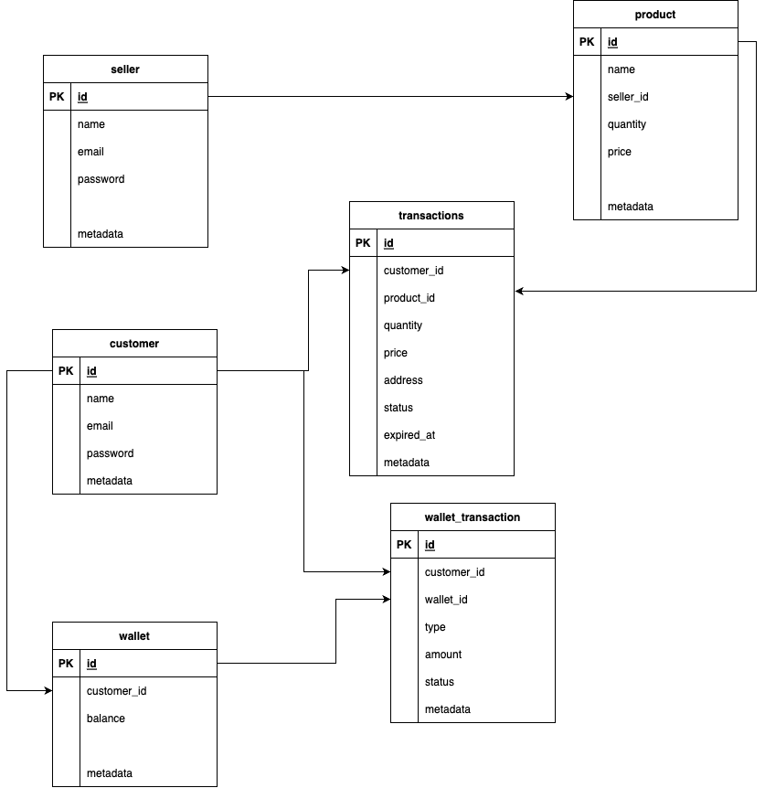

# Golang E-Commerce Project

## How to use
- run the database
```
docker-compose up
```
OR
```
docker-compose up -d
```

- run the golang server
```
go run main.go
```

- to access API documentation
```
http://localhost:9200/docs/index.html#/
```

## ERD


## Framework

- Framework : Go Echo
- API Docs : Swagger
- Database : Postgres